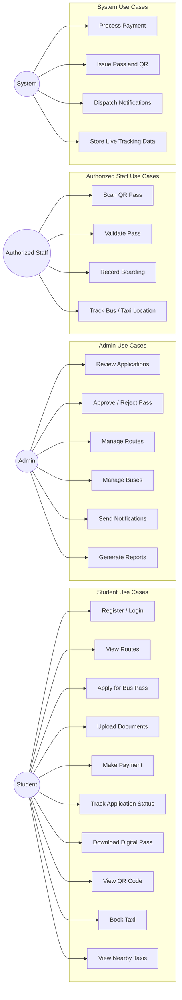
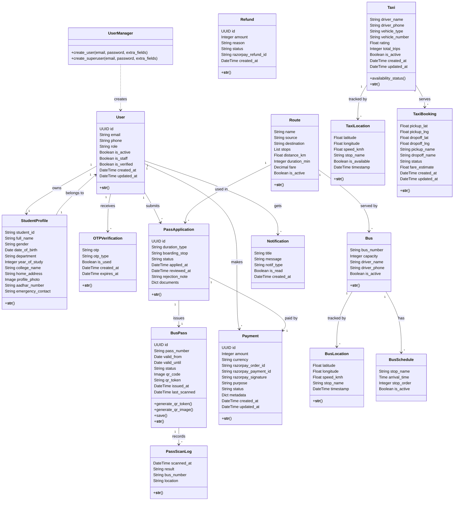

# BusPassPro Project Documentation Draft

This document is aligned with the current Django and React codebase and is written for a college submission. It covers the three items you asked for:

1. Use case diagram
2. Class diagram with methods
3. Data dictionary

## 1. Use Case Diagram

The main actors in BusPassPro are Student, Admin, Authorized Staff, and System services.

### Use Case Notes

- Student workflows focus on registration, pass application, payment, and pass usage.
- Admin workflows focus on review, approval, route management, bus management, and reporting.
- Authorized staff workflows focus on QR validation and boarding verification.
- System workflows cover payment processing, QR generation, notifications, and tracking updates.

## 2. Class Diagram with Methods

The class diagram below includes the main entities and the methods that matter for the project workflow.

### Key Methods To Highlight In The Report

These are the most important behaviors to mention under the class diagram if your teacher asks about methods.

| Class / Component | Method | Purpose |
| --- | --- | --- |
| UserManager | create_user() | Creates a normal account and hashes the password. |
| UserManager | create_superuser() | Creates an admin account with staff and superuser access. |
| BusPass | generate_qr_token() | Builds a tamper-resistant QR payload using a signed token. |
| BusPass | generate_qr_image() | Renders and stores the QR code image. |
| BusPass | save() | Auto-generates QR data before saving the pass. |
| PassApplicationViewSet | approve() | Approves an application and issues a bus pass. |
| PassApplicationViewSet | reject() | Rejects an application with a reason note. |
| BusPassViewSet | qr() | Returns the QR image URL for a valid pass. |
| QRScanView | post() | Verifies QR data and logs the scan result. |
| Taxi | availability_status | Returns a live availability summary for the taxi. |

## 3. Data Dictionary

The data dictionary below lists the main entities, their fields, and what each field stores.

### 3.1 User Module

#### User

| Field | Type | Constraints / Notes | Description |
| --- | --- | --- | --- |
| id | UUID | Primary key | Unique identifier for the user. |
| email | Email | Unique, required | Login and communication email. |
| phone | CharField(15) | Optional | Contact number. |
| role | CharField(20) | Choices: student, admin | Access level for the account. |
| is_active | Boolean | Default true | Indicates whether the account is enabled. |
| is_staff | Boolean | Default false | Allows access to admin panel functions. |
| is_verified | Boolean | Default false | Marks whether the account is verified. |
| created_at | DateTime | Auto timestamp | Time when the account was created. |
| updated_at | DateTime | Auto timestamp | Time when the account was last updated. |

#### StudentProfile

| Field | Type | Constraints / Notes | Description |
| --- | --- | --- | --- |
| user | OneToOneField(User) | Required | Links the profile to the user account. |
| student_id | CharField(20) | Unique, required | College student identification number. |
| full_name | CharField(100) | Required | Student name. |
| gender | CharField(1) | Choices: M, F, O | Gender selection. |
| date_of_birth | DateField | Required | Date of birth. |
| department | CharField(100) | Required | Academic department. |
| year_of_study | IntegerField | Required | Current year of study. |
| college_name | CharField(200) | Required | College name. |
| home_address | TextField | Required | Residential address. |
| profile_photo | ImageField | Optional | Profile image. |
| aadhar_number | CharField(12) | Optional | Identity number. |
| emergency_contact | CharField(15) | Optional | Emergency phone number. |

#### OTPVerification

| Field | Type | Constraints / Notes | Description |
| --- | --- | --- | --- |
| user | ForeignKey(User) | Required | User who receives the OTP. |
| otp | CharField(6) | Required | One-time password. |
| otp_type | CharField(10) | Choices: email, phone | OTP delivery channel. |
| is_used | Boolean | Default false | Indicates whether the OTP has been used. |
| created_at | DateTime | Auto timestamp | OTP creation time. |
| expires_at | DateTime | Required | Time after which the OTP becomes invalid. |

### 3.2 Pass Management Module

#### Route

| Field | Type | Constraints / Notes | Description |
| --- | --- | --- | --- |
| name | CharField(200) | Required | Route name. |
| source | CharField(100) | Required | Starting stop. |
| destination | CharField(100) | Required | Ending stop. |
| stops | JSONField | Default empty list | Intermediate stops in order. |
| distance_km | FloatField | Must be greater than 0 | Route length in kilometres. |
| duration_min | IntegerField | Must be greater than 0 | Estimated travel duration. |
| fare | DecimalField(8,2) | Must be greater than 0 | Route fare. |
| is_active | Boolean | Default true | Controls whether the route is available for selection. |

#### PassApplication

| Field | Type | Constraints / Notes | Description |
| --- | --- | --- | --- |
| id | UUID | Primary key | Unique application ID. |
| student | ForeignKey(User) | Required | Student who submitted the application. |
| route | ForeignKey(Route) | Required | Selected route. |
| duration_type | CharField(20) | Choices: monthly, quarterly, annual | Validity duration chosen by the student. |
| boarding_stop | CharField(100) | Required | Boarding point selected by the student. |
| status | CharField(20) | Choices: pending, approved, rejected | Current application state. |
| applied_at | DateTime | Auto timestamp | Submission time. |
| reviewed_at | DateTime | Optional | Time of admin review. |
| reviewed_by | ForeignKey(User) | Optional | Admin who processed the application. |
| rejection_note | TextField | Optional | Reason for rejection. |
| documents | JSONField | Default empty dict | Uploaded document references. |

#### BusPass

| Field | Type | Constraints / Notes | Description |
| --- | --- | --- | --- |
| id | UUID | Primary key | Unique bus pass ID. |
| application | OneToOneField(PassApplication) | Required | Application from which the pass is issued. |
| pass_number | CharField(20) | Unique, required | Human-readable pass number. |
| valid_from | DateField | Required | Pass start date. |
| valid_until | DateField | Required | Pass end date. |
| status | CharField(20) | Choices: active, expired, revoked | Current pass state. |
| qr_code | ImageField | Optional | Stored QR image file. |
| qr_token | CharField(256) | Optional | Signed QR payload used for validation. |
| issued_at | DateTime | Auto timestamp | Pass issue time. |
| last_scanned | DateTime | Optional | Last scan time. |

#### PassScanLog

| Field | Type | Constraints / Notes | Description |
| --- | --- | --- | --- |
| bus_pass | ForeignKey(BusPass) | Required | Pass that was scanned. |
| scanned_at | DateTime | Auto timestamp | Scan time. |
| result | CharField(20) | Choices: valid, invalid, expired | Outcome of the scan. |
| bus_number | CharField(20) | Optional | Bus identifier entered at scan time. |
| location | CharField(100) | Optional | Scan location. |

### 3.3 Payment Module

#### Payment

| Field | Type | Constraints / Notes | Description |
| --- | --- | --- | --- |
| id | UUID | Primary key | Unique payment ID. |
| user | ForeignKey(User) | Required | User who made the payment. |
| razorpay_order_id | CharField(100) | Unique, required | Razorpay order reference. |
| razorpay_payment_id | CharField(100) | Optional | Razorpay payment reference. |
| razorpay_signature | CharField(256) | Optional | Razorpay verification signature. |
| amount | IntegerField | Must be greater than 0 | Amount stored in paise. |
| currency | CharField(5) | Default INR | Payment currency. |
| purpose | CharField(20) | Choices: PASS_PURCHASE, PASS_RENEWAL, WALLET_TOPUP | Payment purpose. |
| status | CharField(20) | Choices: CREATED, PAID, FAILED, REFUNDED | Payment lifecycle state. |
| metadata | JSONField | Default empty dict | Extra payment details. |
| created_at | DateTime | Auto timestamp | Payment creation time. |
| updated_at | DateTime | Auto timestamp | Payment update time. |

#### Refund

| Field | Type | Constraints / Notes | Description |
| --- | --- | --- | --- |
| id | UUID | Primary key | Unique refund ID. |
| payment | ForeignKey(Payment) | Required | Payment being refunded. |
| razorpay_refund_id | CharField(100) | Optional | Razorpay refund reference. |
| amount | IntegerField | Must be greater than 0 | Refund amount in paise. |
| reason | TextField | Required | Reason for the refund. |
| status | CharField(20) | Choices: PENDING, PROCESSED, FAILED | Refund state. |
| initiated_by | ForeignKey(User) | Optional | Admin or staff who initiated the refund. |
| created_at | DateTime | Auto timestamp | Refund creation time. |

### 3.4 Bus Module

#### Bus

| Field | Type | Constraints / Notes | Description |
| --- | --- | --- | --- |
| bus_number | CharField(20) | Unique, required | Unique bus registration number. |
| route | ForeignKey(Route) | Optional, set null on delete | Route assigned to the bus. |
| capacity | IntegerField | Must be greater than 0 | Maximum passenger capacity. |
| driver_name | CharField(100) | Required | Driver name. |
| driver_phone | CharField(15) | Required | Driver phone number. |
| is_active | Boolean | Default true | Whether the bus is active. |

#### BusLocation

| Field | Type | Constraints / Notes | Description |
| --- | --- | --- | --- |
| bus | ForeignKey(Bus) | Required | Bus being tracked. |
| latitude | FloatField | Must be between -90 and 90 | Current latitude. |
| longitude | FloatField | Must be between -180 and 180 | Current longitude. |
| speed_kmh | FloatField | Must be non-negative | Current speed in km/h. |
| stop_name | CharField(100) | Optional | Nearby stop or landmark. |
| timestamp | DateTime | Auto timestamp | Tracking time. |

#### BusSchedule

| Field | Type | Constraints / Notes | Description |
| --- | --- | --- | --- |
| bus | ForeignKey(Bus) | Required | Bus for the schedule entry. |
| stop_name | CharField(100) | Required | Stop name. |
| arrival_time | TimeField | Required | Scheduled arrival time. |
| stop_order | IntegerField | Must be non-negative | Stop sequence order. |
| is_active | Boolean | Default true | Whether the schedule is active. |

### 3.5 Taxi Module

#### Taxi

| Field | Type | Constraints / Notes | Description |
| --- | --- | --- | --- |
| driver_name | CharField(100) | Required | Taxi driver name. |
| driver_phone | CharField(15) | Unique, required | Driver contact number. |
| vehicle_type | CharField(20) | Choices: sedan, suv, auto | Taxi vehicle category. |
| vehicle_number | CharField(20) | Unique, required | Vehicle registration number. |
| rating | FloatField | Range 0 to 5 | Driver or vehicle rating. |
| total_trips | IntegerField | Must be non-negative | Completed trip count. |
| is_active | Boolean | Default true | Whether the taxi is available in the system. |
| created_at | DateTime | Auto timestamp | Record creation time. |
| updated_at | DateTime | Auto timestamp | Last record update time. |

#### TaxiLocation

| Field | Type | Constraints / Notes | Description |
| --- | --- | --- | --- |
| taxi | ForeignKey(Taxi) | Required | Taxi being tracked. |
| latitude | FloatField | Must be between -90 and 90 | Taxi latitude. |
| longitude | FloatField | Must be between -180 and 180 | Taxi longitude. |
| speed_kmh | FloatField | Must be non-negative | Current speed. |
| stop_name | CharField(100) | Optional | Nearby stop or location label. |
| is_available | Boolean | Default true | Availability at the current location record. |
| timestamp | DateTime | Auto timestamp | Tracking time. |

#### TaxiBooking

| Field | Type | Constraints / Notes | Description |
| --- | --- | --- | --- |
| student | ForeignKey(User) | Required | Student who requested the taxi. |
| taxi | ForeignKey(Taxi) | Optional, set null on delete | Assigned taxi. |
| pickup_lat | FloatField | Must be between -90 and 90 | Pickup latitude. |
| pickup_lng | FloatField | Must be between -180 and 180 | Pickup longitude. |
| dropoff_lat | FloatField | Optional, range validated if present | Drop-off latitude. |
| dropoff_lng | FloatField | Optional, range validated if present | Drop-off longitude. |
| pickup_name | CharField(150) | Required | Pickup location name. |
| dropoff_name | CharField(150) | Optional | Drop-off location name. |
| status | CharField(20) | Choices: requested, accepted, arrived, ongoing, completed, cancelled | Booking state. |
| fare_estimate | FloatField | Optional, non-negative if present | Estimated fare. |
| created_at | DateTime | Auto timestamp | Booking creation time. |
| updated_at | DateTime | Auto timestamp | Booking update time. |

### 3.6 Notification Module

#### Notification

| Field | Type | Constraints / Notes | Description |
| --- | --- | --- | --- |
| user | ForeignKey(User) | Required | Recipient of the notification. |
| title | CharField(200) | Required | Notification title. |
| message | TextField | Required | Notification content. |
| notif_type | CharField(10) | Choices: email, sms | Delivery channel. |
| is_read | Boolean | Default false | Read status. |
| created_at | DateTime | Auto timestamp | Notification creation time. |

## 4. Short Submission Summary

If you want a brief explanation to include in your report, you can write:

"BusPassPro is a city transit pass management system that supports student registration, route management, bus pass applications, online payments, QR-based validation, live bus and taxi tracking, and admin notifications. The use case diagram shows how students, admins, and authorized staff interact with the system. The class diagram captures the core entities and their methods, while the data dictionary defines every major field used by the application."