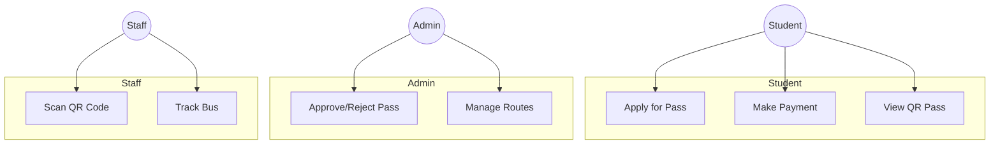
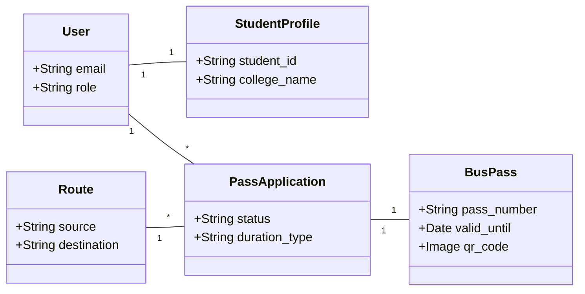

# BusPassPro Simplified Documentation

## 1. System Overview
BusPassPro is a digital bus pass management system designed for students. It automates the application, payment, and verification process using QR codes and live tracking.

## 2. Use Case Diagram
The system involves Students, Admins, and Staff.

## 3. Core Class Diagram
Simplified view of the main system entities.

## 4. Data Dictionary (Key Tables)

### User & Profile
| Field | Type | Description |
| --- | --- | --- |
| email | String | Unique login identifier |
| role | String | student or admin |
| student_id | String | College ID number |

### Pass Management
| Field | Type | Description |
| --- | --- | --- |
| route | Link | Selected bus route |
| status | String | pending, approved, or rejected |
| pass_number | String | Unique issued pass ID |
| valid_until | Date | Expiry date of the pass |

### Routes & Buses
| Field | Type | Description |
| --- | --- | --- |
| source | String | Starting point |
| destination | String | Ending point |
| bus_number | String | Vehicle registration number |
